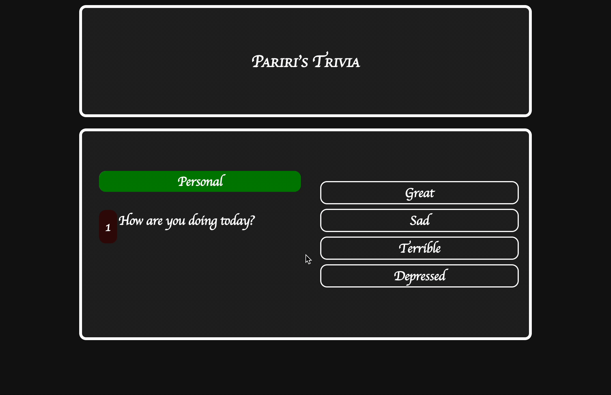

# Pariri's Trivia-App
Generate a 10 question trivia for user to play. Fetches trivia questions from opentdb trivia API.

Resources: React JS, opentdb API: https://opentdb.com/api.php

📝 `NOTE:` Below is the App Walkthrough
### App Walk-through

- [x] Fetches 10 trivia questions from opentdb API
- [x] Displays red or green if user chooses the wrong or right answer
- [x] Displays the user's score at the end
- [x] Push code to GitHub
